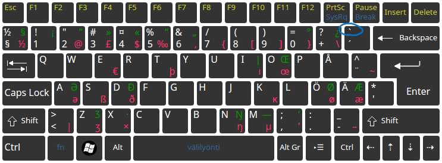
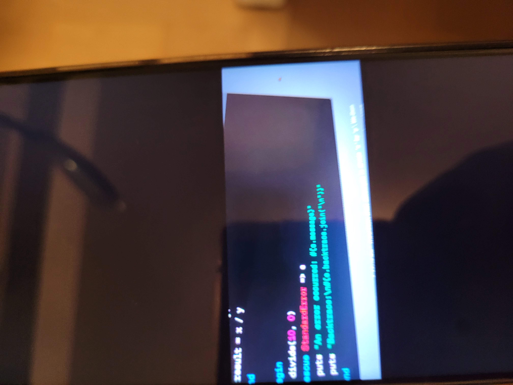
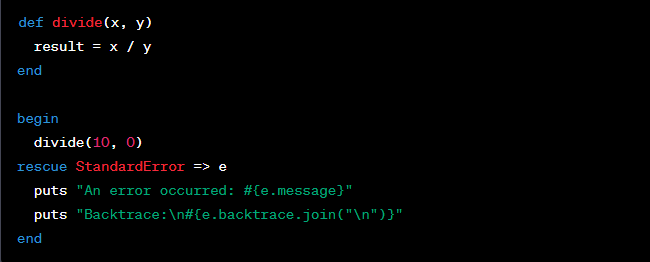
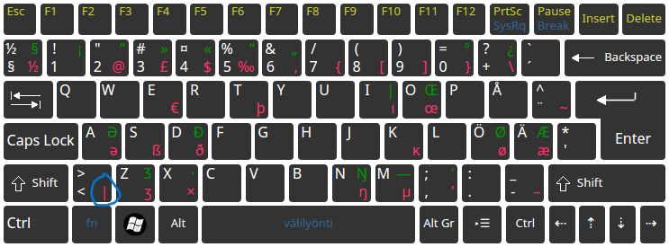

# Writing Good Documentation

## Step - 1 - Using Codeblocks.

Codeblocks in markdown make it *very easy* for tech people to **copy, paste, share** code.
A good _Cloud Engineer_ uses Codeblocks whenever possible.

Because it allows other to copy and paste heir code to replicate or research issues.

- In order to create codeblocks in markdown you need to use three backticks (`)
- Not to be confused with quotation (')

```
def factorial(n)
  if n == 0
    return 1
  else
    return n * factorial(n - 1)
  end
end

# Test the factorial function
puts "Enter a number to calculate its factorial:"
number = gets.chomp.to_i

if number < 0
  puts "Factorial is not defined for negative numbers."
else
  result = factorial(number)
  puts "The factorial of #{number} is #{result}."
end
```


- When you can you should attempt to apply syntax highlighting to your codeblocks

 ```ruby
def factorial(n)
  if n == 0
    return 1
  else
    return n * factorial(n - 1)
  end
end

# Test the factorial function
puts "Enter a number to calculate its factorial:"
number = gets.chomp.to_i

if number < 0
  puts "Factorial is not defined for negative numbers."
else
  result = factorial(number)
  puts "The factorial of #{number} is #{result}."
end
```

- Make note of where the backtick key is located. 
- It should appear next to backspace key, but it may vary based on your keyboard layout.



Good cloud engineers use codeblocks for both code and errors that appear in the console.

```bash
An error occurred: divided by 0
Backtrace:
example.rb:2:in `/'
example.rb:2:in `divide'
example.rb:8:in `<main>'
```
>Here is an example of using a codeblock for an error that appears in bash.

When you can, always provide a codeblock instead of a screenshot.
If you need to take a screenshot, make sure it is not a photo from your phone.

> There are certain cases where its okay to take photos with your phone. This is when you are showing something like a keyboard, which does not appear on a computer screen.
> If it renders on your computer screen, it should be a screenshot.

## Step 2 - How to take screenshots

A Screenshot is when you capture a part of your screen from your laptop, desktop or phone.

This is not to be confused with taking a photo with your phone.

**DON'T DO THIS**



This is what a screenshot should look like:

**DO THIS INSTED**


To take screenshots on both Mac and Windows, you can use built-in hotkeys or keyboard shortcuts. Here are the common hotkeys for taking screenshots on both platforms:

**For Mac:**

1. **Capture Entire Screen:**
   - Press `Shift + Command (⌘) + 3`.
   - The screenshot is saved to your desktop by default.

2. **Capture Selected Portion of the Screen:**
   - Press `Shift + Command (⌘) + 4`.
   - Drag to select the portion of the screen you want to capture.
   - Release the mouse button to take the screenshot.
   - The screenshot is saved to your desktop by default.

3. **Capture a Specific Window:**
   - Press `Shift + Command (⌘) + 4`, then press `Spacebar`.
   - Click on the window you want to capture.
   - The screenshot is saved to your desktop by default.

**For Windows:**

1. **Capture Entire Screen:**
   - Press `PrtScn` (Print Screen) key.
   - The screenshot is copied to your clipboard and can be pasted into an image editor or document.

2. **Capture Active Window:**
   - Press `Alt + PrtScn`.
   - The screenshot of the currently active window is copied to your clipboard.

3. **Capture Selected Portion of the Screen (Windows 10 and later):**
   - Press `Windows + Shift + S`.
   - A screenshot toolbar appears at the top of the screen, allowing you to select the area to capture.
   - The screenshot is copied to your clipboard and can be pasted into an image editor or document.

4. **Capture Screen and Save as a File (Windows 10 and later):**
   - Press `Windows + Shift + S`, then press `Enter`.
   - After selecting the area to capture, the screenshot is saved to your clipboard and can be pasted or saved as an image file.

Please note that the exact hotkeys and features may vary depending on your specific version of macOS or Windows. 

## Step 3 - Use Github Flavored Task Lists

Github extends Markdown to have a list where you can chack off items.  [<sup>[1]</sup>](#references)

 - [x] Finish Step 1
 - [ ] Finish Step 2
 - [ ] Finish Step 3 

# Step 4 - Use Emojis (Optional)
GitHub Flavored Markdown (GFM) supports emoji shortcodes.
| Name | Shortcode | Emoji |
| --- | --- | --- |
| Cloud | `:cloud:` | :cloud: |
| Cloud with lightning | `:cloud_with_lighting:` | :cloud_with_lighting: |

# Step 5 - How to create a table

```md
| Name | Shortcode | Emoji |
| --- | --- | --- |
| Cloud | `:cloud:` | :cloud: |
| Cloud with lightning | `:cloud_with_lighting:` | :cloud_with_lighting: |
``` 
Github extends the functionality of Markdown tables to provide more alignment and table cell formatting options [<sup>[2]</sup>](#references)

- Make note of where the pipe key is located. 
- It should appear next to `z` key, but it may vary based on your keyboard layout.


## References
- [GitHub Flavored Markdown Spec](https://github.github.com/gfm/) 
- [Basic writing and formatting syntax (Github Flavored Markdown)](https://docs.github.com/en/get-started/writing-on-github/getting-started-with-writing-and-formatting-on-github/basic-writing-and-formatting-syntax) 
- [GFM - Task Lists](https://docs.github.com/en/get-started/writing-on-github/getting-started-with-writing-and-formatting-on-github/basic-writing-and-formatting-syntax#task-lists) <sup>[1]</sup>
- [GTM - Emoji CheatSheet](https://github.com/ikatyang/emoji-cheat-sheet/tree/master)
- [GFM Tables ( with extensions)](https://github.github.com/gfm/#tables-extension-) <sup>[2]</sup>
